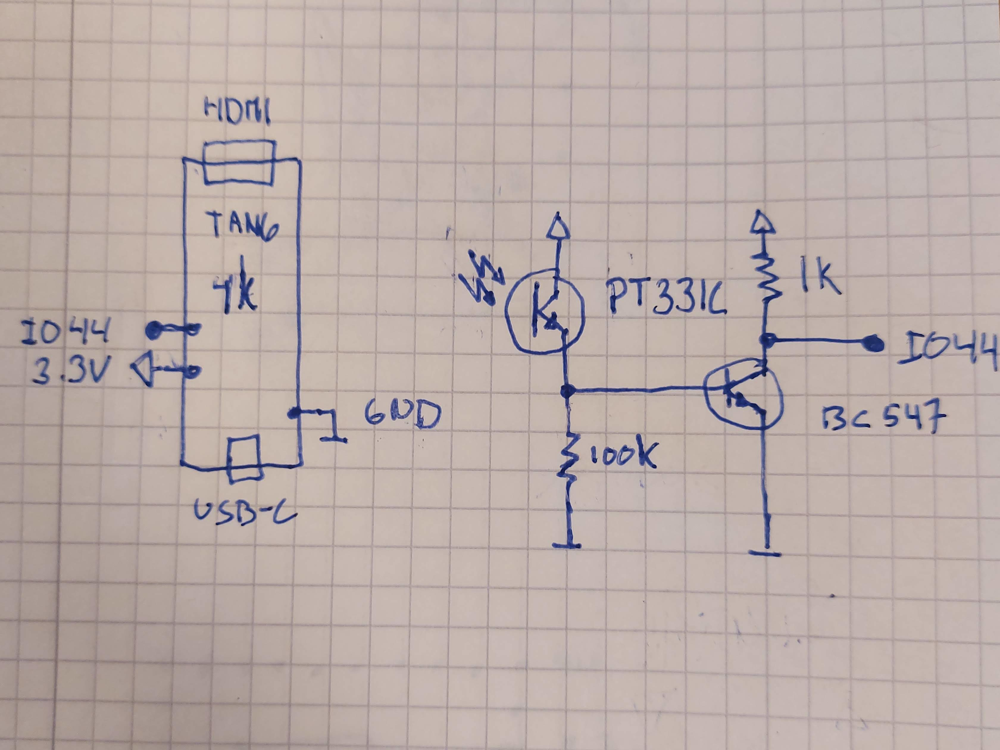

# Video Lag Tester

A Video Lag Tester is a device that measures the delay from when a signal is sent to a displays input until it is shown on the display. In most cases this is an important parameters for a good gaming experince.

It is intended to be a low cost solution for video signals up to 720p 60 Hz. The cost to build it your self is ~$25 or less.

It is based on source code of [Time sleuth](https://github.com/chriz2600/time-sleuth)

This project is created by **Patrik's Retro Tech**. For updates and similar projects follow me on:\
[Instagram](https://www.instagram.com/patriksretrotech/)\
[YouTube](https://www.youtube.com/channel/UCaFWrgS4kNwspYCvaff0Wjg)\
[Twitter](https://twitter.com/patriksretrotec/)\
[Facebook](https://facebook.com/patriksretrotech)

## Flash firmware
Download and unpack the [release zip file](https://github.com/pthalin/video_lag_tester/releases/latest/). Plug in a USB-C cable to the board. No driver needs to be installed.

### Linux:
Install [openFPGALoader](https://github.com/trabucayre/openFPGALoader)

run:\
openFPGALoader -b tangnano4k -f firmware\\video_lag_tester_720p60.fs

### Windows:
Double click on "load_720p.cmd"

## Build
Use: Gowin FPGA Designer 1.9.8.03 Education

## Hardware
Sipeed Tang Nano 4K FPGA board\
Phototransistor for visable light with clear case\
PNP Transistor e.g. BC547\
1k and 100k Resistor

## Schematic and how to build

\

